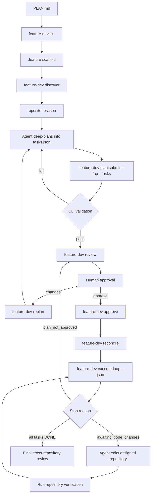

# Feature Dev Orchestrator

Feature Dev Orchestrator is a workspace-native command-line tool designed to help development teams and AI coding agents manage feature work across one or many Git repositories in a structured, deterministic way.

It is especially useful when:

- your project lives across multiple repositories
- you want a clean workspace-level workflow for feature planning and execution
- you want to track which repo owns which task
- you want to reduce context confusion between repos
- you want state to survive across IDE sessions and agent restarts
- you want deterministic orchestration rather than ad hoc coding flow

## What this tool provides

This tool gives you a simple operational model:

- Workspace = the orchestration boundary
- Repository = the execution and verification boundary
- Cursor/Copilot = the reasoning and implementation layer
- feature-dev = the workflow control layer

In practical terms, the tool helps you:

- initialize a feature workspace
- discover Git repositories in the workspace
- keep repo information in a structured registry
- decompose features into a repo-aware task DAG in `.feature/tasks/tasks.json`
- validate plan quality (repo assignments, dependencies, verification) before coding
- require explicit human approval before implementation begins
- understand the current workspace and workflow state
- execute tasks deterministically with repository-scoped verification
- resume safely across IDE sessions and agent restarts

## Why this tool exists

AI-assisted development can get messy when:

- the agent keeps re-discovering repo structure
- tasks are spread across repos without dependency tracking
- the wrong repo is used for verification or execution
- context is too large or too mixed across unrelated repos
- a session ends and the state is lost

Feature Dev Orchestrator fixes these problems by separating the responsibilities clearly:

- the AI agent reasons about code and implementation
- the tool handles workspace setup, repository discovery, state, and execution coordination

This makes the development workflow more reliable and easier to resume.

## Deep planning and human review

The most common failure mode in multi-repo AI-assisted development is not bad code — it is **bad planning**: wrong repo assignments, missing dependencies, and coding that starts before anyone reviews the breakdown.

This tool addresses that with a **tasks.json-first planning workflow** backed by a strict **planning bundle** under `.feature/plans/draft/`:

1. The agent reads `PLAN.md` and inspects relevant repositories (no production code changes during planning).
2. The agent writes the planning bundle: `requirements.json`, `assumptions.json`, `risks.json`, `impact.json`, `repo-analysis.json` (optional `workspace-verify.json`).
3. The agent writes `.feature/tasks/tasks.json` with repo assignments, dependencies, verification commands, and planning metadata.
4. `feature-dev plan submit --from-tasks` validates the bundle + tasks and creates an immutable revision snapshot.
5. On validation failure, workflow enters `CLARIFICATION_NEEDED`; run `feature-dev plan clarify --json`, ask the user, update artifacts, and resubmit.
6. `feature-dev review` presents tasks.json plus requirements, assumptions, risks, impact, and verification strategy for human review.
7. `feature-dev approve` unlocks execution; `start` and `execute-loop` remain blocked until then.
8. When all tasks are `DONE`, `feature-dev finalize --json` runs traceability + cross-repo verification and auto-sets `COMPLETED` on pass.

Planning metadata on each task (optional but recommended):

| Field | Purpose |
|-------|---------|
| `repository_rationale` | Why this repo owns the task |
| `ownership_confidence` | `HIGH`, `MEDIUM`, or `LOW` |
| `requirement_ids` | Trace tasks back to requirements in `PLAN.md` |
| `planned_verification` | Human-readable verification intent |

CLI validation catches structural plan problems before `REVIEW_PENDING`:

- missing planning bundle files (requirements, assumptions, risks, impact, repo-analysis)
- unknown or missing repository assignments
- broken DAG (cycles, missing dependencies)
- missing title or verification command
- duplicate or empty task IDs
- orphan requirements or untraced requirement IDs
- **error**: LOW ownership confidence on a task with cross-repo downstream dependents
- **warning**: cross-repo dependencies, untraced requirements, all tasks blocked

Each submitted revision snapshots tasks to `.feature/plans/revision-NNN/tasks.json` for audit and diff.

## How this is better than normal prompting in multi-repo workspaces

In a single repository, normal prompting can often be enough. In multi-repo workspaces, the same approach becomes fragile because context, execution location, and task ordering can drift between sessions.

Feature Dev Orchestrator improves this by adding deterministic coordination around the agent:

- clear boundaries: workspace for orchestration, repository for execution and verification
- durable state: task and repository state is persisted under `.feature` across restarts
- dependency-aware sequencing: tasks become ready only when dependencies are actually satisfied
- repository-aware verification: checks run in the correct repository with tracked outputs
- reconciliation support: stale or interrupted states are repaired before continuing
- lower cognitive load: less repeated prompting about repo ownership, status, and next steps
- consistent team workflow: shared commands create repeatable behavior across contributors

Practical takeaway: normal prompting is flexible but easy to derail in multi-repo feature work. This tool keeps prompting focused on reasoning and coding, while orchestration mechanics — including **plan validation and approval gates** — remain stable and resumable.

## How it works at a high level

The tool is intentionally simple and deterministic.

1. You run `feature-dev init` in a workspace.
2. It creates a `.feature` folder for orchestration metadata.
3. It discovers Git repositories under the workspace.
4. It stores repository information in a structured registry.
5. The agent writes and submits a task plan (`plan submit --from-tasks`).
6. The CLI validates the plan and waits for human approval.
7. After approval, orchestration commands select the next task, enforce repo boundaries, and track verification.
8. The result is a controlled workflow for planning, review, execution, and resume.

The tool does not replace the coding agent. Instead, it helps the agent work inside a structured feature workflow with enforced checkpoints.

## Project architecture

The following structure reflects the design:

```text
feature-dev-orchestrator/
├── cmd/feature-dev/main.go
├── internal/orchestrator/
│   ├── workspace.go          # init, discover, repositories registry
│   ├── tasks.go              # task graph persistence
│   ├── plan.go               # plan revisions, BuildPlanFromTasks
│   ├── task_plan_validate.go # repo/DAG/ownership validation
│   ├── plan_validate.go      # plan document validation
│   ├── plan_review.go        # tasks.json-first review output
│   ├── plan_commands.go      # submit, review, approve, replan
│   ├── approval.go           # approval gate for execution
│   ├── workflow.go           # workflow state machine
│   ├── execute_next.go       # execute-next / execute-loop
│   └── agent_hint.go         # agent routing hints
├── .github/skills/feature-dev-orchestrator/
│   ├── SKILL.md              # agent deep-planning procedure
│   └── assets/task-dag-template.json
└── testdata/plans/           # plan validation fixtures
```

## Key concepts

### 1. Workspace
A workspace is the folder opened in your editor or terminal for a feature. It is the coordination boundary for planning and execution.

### 2. Repository
A repository is a Git project inside the workspace. Each repo is treated as its own execution, context, Git, and verification boundary.

### 3. Feature state
The tool keeps orchestration metadata in `.feature`, which is reserved for workflow and state artifacts.

### 4. Workflow state
Plan revisions progress through workflow states such as `REVIEW_PENDING`, `APPROVED`, and `REPLANNING`. State is persisted under `.feature/state/workflow.json` and gates execution until approval.

### 5. Deterministic behavior
The tool is designed to behave consistently and predictably, instead of depending on hidden agent state or ad hoc assumptions.

## `.feature` Lifecycle Example

The `.feature` directory is created by `feature-dev init` at the workspace
root. The following example shows a multi-repository feature after planning,
implementation, verification, and completion:

```text
my-feature-workspace/
├── PLAN.md
├── .feature/
│   ├── config.yaml
│   ├── repositories.json
│   ├── workflow.yaml
│   ├── state/
│   │   ├── workflow.json
│   │   └── task-summaries.jsonl
│   ├── tasks/
│   │   └── tasks.json                 # live task graph (primary review artifact)
│   ├── plans/
│   │   ├── draft/
│   │   │   └── plan.yaml              # optional advanced draft path
│   │   └── revision-001/
│   │       ├── plan.yaml
│   │       ├── tasks.json             # immutable snapshot at submit time
│   │       ├── review.md
│   │       ├── summary.md
│   │       └── dag.json
│   ├── context/                       # reserved for generated context
│   ├── artifacts/
│   │   ├── verify-t001-<timestamp>.json
│   │   └── verify-t002-<timestamp>.json
│   ├── reviews/                       # reserved for review artifacts
│   └── logs/                          # reserved for workflow logs
├── checkout-web/
│   └── .git/
├── payments-api/
│   └── .git/
└── shared-contracts/
    └── .git/
```

`init` creates the directories and default `config.yaml`, empty
`repositories.json`, and `workflow.yaml`. The other files appear as the
corresponding commands need them. Empty reserved directories may remain empty
after a successful run.

### Representative schemas

`.feature/config.yaml` stores workspace discovery settings:

```yaml
schema_version: "1.0"
repository_discovery:
	mode: auto
	include:
		- ./*
	exclude:
		- .git
		- node_modules
		- dist
		- build
		- target
```

`.feature/repositories.json` is the discovered repository registry:

```json
[
	{
		"id": "payments-api",
		"path": "payments-api",
		"git_root": "payments-api",
		"mode": "read_write"
	},
	{
		"id": "checkout-web",
		"path": "checkout-web",
		"git_root": "checkout-web",
		"mode": "read_write"
	}
]
```

`.feature/tasks/tasks.json` is the persisted task graph and the **primary artifact for human review**. The agent creates or updates it from `PLAN.md`; the CLI owns status transitions after approval:

```json
[
  {
    "id": "T001",
    "title": "Add authorization contract",
    "repository": "shared-contracts",
    "status": "REVIEW_PENDING",
    "dependencies": [],
    "repository_rationale": "Shared DTOs live in the contracts repo",
    "ownership_confidence": "HIGH",
    "requirement_ids": ["R001"],
    "planned_verification": ["Contract tests pass in shared-contracts"],
    "acceptance_criteria": [
      "The authorization request and response types are available to consumers."
    ],
    "verification": [
      { "command": "npm test" }
    ]
  },
  {
    "id": "T002",
    "title": "Implement API authorization",
    "repository": "payments-api",
    "status": "REVIEW_PENDING",
    "dependencies": ["T001"],
    "repository_rationale": "payments-api owns the authorization endpoint",
    "ownership_confidence": "HIGH",
    "requirement_ids": ["R001"],
    "acceptance_criteria": [
      "The API validates authorization requests and returns the documented response."
    ],
    "verification": [
      { "command": "go test ./..." }
    ]
  }
]
```

During planning, keep task status at `REVIEW_PENDING` or `PLANNED` — never `RUNNING`. After approval, the orchestrator transitions tasks through `READY` → `RUNNING` → `IMPLEMENTED` → `VERIFYING` → `DONE`.

Each line in `.feature/state/task-summaries.jsonl` records a lifecycle event:

```json
{"timestamp":"2026-09-12T12:00:00Z","task_id":"T002","repository":"payments-api","status":"RUNNING","event":"execute_next_started","message":"execute-next moved task to RUNNING"}
{"timestamp":"2026-09-12T12:08:00Z","task_id":"T002","repository":"payments-api","status":"DONE","event":"verification_passed","message":"verification command completed successfully"}
```

Each verification writes a JSON artifact under `.feature/artifacts` containing
the task, repository, command, working directory, exit code, output, and
execution timestamp:

```json
{
	"repository_id": "payments-api",
	"working_directory": "payments-api",
	"command": "go test ./...",
	"timeout_seconds": 300,
	"exit_code": 0,
	"task_id": "T002",
	"output": "ok   payments-api/...",
	"executed_at": "2026-09-12T12:08:00Z"
}
```

### Command flow



### Typical command sequence

```bash
feature-dev init
feature-dev discover
feature-dev doctor
feature-dev agent-hint --json
feature-dev plan draft init
feature-dev task init
# Agent analyzes PLAN.md + repos, edits scaffolded planning bundle + tasks.json
feature-dev schema show tasks --json   # canonical JSON contract
feature-dev task preview --json
feature-dev plan submit --from-tasks
# structural errors: schema show + plan draft init / task init → preview again
# domain errors: feature-dev plan clarify --json → fix → resubmit
feature-dev review --json
feature-dev graph
# user reviews tasks.json and approves
feature-dev approve
feature-dev reconcile
feature-dev execute-loop --json
# when all tasks DONE:
feature-dev finalize --json
# Agent implements the returned task in its assigned repository.
# Repeat verification and execute-loop until every task is DONE.
feature-dev status --json
```

## Installation

### Prerequisites

You need:

- Go installed on your machine
- a terminal
- a workspace folder

### Build the CLI

From the project root:

```bash
go build ./cmd/feature-dev
```

This creates a binary named `feature-dev` in the current directory, or in the generated output path depending on your environment.

### Run it directly

```bash
./feature-dev --help
```

If you want to run it globally:

```bash
go install ./cmd/feature-dev
```

Go installs the binary into `$(go env GOPATH)/bin` unless `GOBIN` is set. Add
that directory to your shell startup files so the command works from every
workspace:

```bash
export PATH="$(go env GOPATH)/bin:$PATH"
```

For a permanent macOS setup, place the export in `.zshenv` and `.zshrc`. If
you use Bash, place it in `.bashrc` and source `.bashrc` from `.bash_profile`.
Then restart the terminal or reload the relevant startup file.

Verify the global installation:

```bash
command -v feature-dev
feature-dev version
feature-dev agent-hint --json
```

The optional helper alias below is convenient for agent routing:

```bash
alias feature-dev-agent='feature-dev agent-hint --json'
```

Then you can run it as:

```bash
feature-dev --help
```

## Beginner usage guide

The following steps show the simplest way to use the tool.

### Step 1: Open your workspace

Navigate to the folder you want to use as the orchestration workspace.

```bash
cd /path/to/your/workspace
```

### Step 2: Initialize the workspace

```bash
feature-dev init
```

What this does:

- creates the `.feature` directory
- creates default configuration
- creates repo registry storage
- creates state/context/artifact/log directories

You can verify it worked by listing the `.feature` directory:

```bash
ls -la .feature
```

### Step 3: Discover repos

```bash
feature-dev discover
```

This scans the workspace for Git repositories and records them in `.feature/repositories.json`.

You can view them with:

```bash
feature-dev repositories
```

### Step 4: Check workspace status

```bash
feature-dev status
```

This gives an overview of the workspace and helps confirm the setup is ready.

### Step 5: Check health

```bash
feature-dev doctor
```

This validates that the workspace is properly configured.

### Step 6: Scaffold and complete planning artifacts

Scaffold valid planning files from built-in templates:

```bash
feature-dev plan draft init
feature-dev task init
feature-dev schema show tasks --json
```

After reading `PLAN.md` and inspecting relevant repositories, edit the scaffolded files. `tasks.json` must be a **top-level JSON array** (not `{"tasks": [...]}`). Each task's `verification` field must be an array of objects with a `command` field.

Each task needs at minimum:

- `id`, `title`, `repository`, `dependencies`, `verification`
- a repository name that matches `.feature/repositories.json`

Draft bundle files use wrapper objects: `{"requirements": [...]}`, `{"assumptions": [...]}`, etc. Use `feature-dev schema show <artifact> --json` for the exact contract.

Recommended planning fields:

- `repository_rationale`, `ownership_confidence`, `requirement_ids`, `planned_verification`

### Step 7: Submit, review, and approve

Submit the plan for CLI validation and human review:

```bash
feature-dev graph
feature-dev task preview --json
feature-dev plan submit --from-tasks
# on failure: feature-dev plan clarify --json → fix bundle/tasks → resubmit
feature-dev review
feature-dev review --json   # machine-readable output for agents
```

Review output leads with `.feature/tasks/tasks.json` plus requirements, assumptions, risks, impact, and validation warnings. Approve explicitly when ready:

```bash
feature-dev approve
```

If changes are needed:

```bash
feature-dev replan --reason "adjust repo assignments"
# revise tasks.json, then resubmit
feature-dev plan submit --from-tasks
feature-dev review
```

### Step 8: Validate before execution

Run these checks before starting work:

```bash
feature-dev reconcile
feature-dev ready
feature-dev graph
feature-dev status --json
```

What each command does:

- `reconcile`: repairs stale or interrupted task state
- `ready`: shows tasks eligible for execution (requires approval when a plan revision exists)
- `graph`: validates dependency relationships
- `status --json`: shows workflow status including `APPROVED` / `REVIEW_PENDING`

### Step 9: Execute work (recommended autonomous mode)

For a single safe autonomous step:

```bash
feature-dev execute-next --json
```

For bounded multi-step autonomous execution:

```bash
feature-dev execute-loop --json
```

Use `execute-loop` as default and rerun it after each coding pass.

### Step 10: Handle stop reasons

When `execute-loop` stops, use this mapping:

- `plan_not_approved`: run review flow and obtain approval before coding
- `awaiting_code_changes`: implement code changes, then rerun `feature-dev execute-loop --json`
- `verify_failure_budget_reached`: inspect verify output/artifacts, fix issues, then rerun loop
- `no_executable_task`: add/fix tasks or dependencies, run `reconcile`, rerun loop
- `max_steps_reached`: rerun loop or increase `--max-steps`

### Step 11: Optional manual mode

Use manual mode when you need explicit control over each transition:

```bash
feature-dev start T001
feature-dev context T001 --level brief --json
# implement code changes
feature-dev verify T001
feature-dev complete T001
```

If work fails:

```bash
feature-dev fail T001
feature-dev reconcile
```

## Example flow

Here is a typical end-to-end flow with deep planning and approval:

```bash
cd my-feature-workspace
feature-dev init
feature-dev discover
feature-dev repositories
feature-dev status
feature-dev doctor
feature-dev agent-hint --json

# Agent reads PLAN.md, inspects repos, writes .feature/tasks/tasks.json
feature-dev graph
feature-dev plan submit --from-tasks
feature-dev review --json

# Human approves repo assignments and task breakdown
feature-dev approve

feature-dev reconcile
feature-dev ready
feature-dev execute-loop --json
```

Rerun `feature-dev execute-loop --json` after each code-change pass until all planned tasks are complete.

## Using with GitHub Copilot or Cursor

The tool does not run inside Copilot or Cursor as an extension. It is a
workspace-level CLI that the coding agent runs from the integrated terminal.
The agent remains responsible for reasoning and editing code; `feature-dev`
keeps task selection, repository ownership, state transitions, and verification
deterministic.

Open the same workspace folder in VS Code with Copilot or in Cursor, then give
the agent a request like this:

```text
Use feature-dev-orchestrator to implement PLAN.md.

Do deep planning first: inspect relevant repositories, assign each subtask to the
correct repo with rationale, and write .feature/tasks/tasks.json with a valid DAG.
Do not modify production code during planning.

Then run:
  feature-dev plan submit --from-tasks
  feature-dev review --json
  feature-dev graph

Show me the tasks.json task list, repo assignments, dependencies, and any validation
warnings. Wait for my explicit approval before implementation.

After I approve, run feature-dev approve and then execute-loop --json.
```

For post-approval execution, use this operating procedure:

```text
Use the feature-dev CLI as the orchestration layer for this feature.
Run `feature-dev doctor`, then `feature-dev reconcile` and
`feature-dev execute-loop --json`.

When the result says `awaiting_code_changes`, inspect the returned task and
repository, make the required changes only in that repository, run the
repository's tests, and run `feature-dev execute-loop --json` again.
When verification fails, inspect the verification output and artifacts, fix the
underlying issue, and rerun the loop. Continue until all tasks are DONE or
report the exact stop reason and task that needs input.
```

A normal agent pass after approval looks like this:

1. Run `feature-dev execute-loop --json` from the workspace root.
2. Read the JSON `status`, `task`, and `repository` fields.
3. If the status is `awaiting_code_changes`, open the assigned repository and
	implement that task. Do not assume the workspace root is the repository.
4. Run the repository's tests or the verification command configured for the
	task.
5. Run `feature-dev execute-loop --json` again so the orchestrator records the
	result and selects the next dependency-ready task.

Useful manual commands while working with an agent are:

```bash
feature-dev status --json
feature-dev repositories --json
feature-dev ready --json
feature-dev agent-hint --json
feature-dev context T001 --level brief --json
feature-dev execute-next --json
```

Use `execute-next` when you want to supervise one transition at a time. Use
`execute-loop` for the normal bounded workflow. The agent should treat a stop
reason such as `awaiting_code_changes`, `verify_failure_budget_reached`,
`no_executable_task`, or `max_steps_reached` as an instruction about what to do
next, rather than repeatedly invoking the command without inspecting the
result.

### Copilot in VS Code

1. Open the orchestration workspace in VS Code.
2. Open Copilot Chat or Agent mode with the integrated terminal available.
3. Paste the operating procedure above, or ask Copilot to use
	`feature-dev execute-loop --json` for the current feature.
4. Review the proposed edits and terminal commands. Copilot should edit the
	repository named by the CLI result, then return to the workspace root for
	the next orchestration command.

### Cursor

1. Open the orchestration workspace as the Cursor project.
2. Ensure the integrated terminal starts at the workspace root and the
	`feature-dev` binary is on `PATH`.
3. Give Cursor the same operating procedure and ask it to preserve the
	`.feature` state directory.
4. Let Cursor work on one returned task at a time, checking the JSON result
	after each coding and verification pass.

Do not ask the agent to invent task state by changing statuses manually unless
you are using the explicit manual commands. The CLI is the source of truth for
transitions and resume behavior.

## Commands overview

```bash
feature-dev version
feature-dev doctor
feature-dev init
feature-dev discover
feature-dev repositories
feature-dev status
feature-dev agent-hint
feature-dev plan submit --from-tasks
feature-dev plan clarify
feature-dev review
feature-dev task preview
feature-dev traceability-check
feature-dev verify-cross-repo
feature-dev finalize
feature-dev task add T001 "Task title"
feature-dev plan-diff
feature-dev approve
feature-dev reject
feature-dev replan
feature-dev graph
feature-dev ready
feature-dev start T001
feature-dev context T001
feature-dev verify T001
feature-dev complete T001
feature-dev fail T001
feature-dev reconcile
feature-dev verify-workspace
feature-dev execute-next --json
feature-dev execute-loop --json
```

### `feature-dev version`
Shows the current CLI version.

### `feature-dev doctor`
Checks whether the workspace is initialized and configured correctly.

### `feature-dev init`
Creates the workspace orchestration scaffolding.

### `feature-dev discover`
Scans for Git repositories and saves them to the registry.

### `feature-dev repositories`
Shows the discovered repository registry.

### `feature-dev status`
Shows basic workspace state information.

### `feature-dev agent-hint`
Emits a structured routing hint for coding agents, including suggested next command, prompt text, trigger phrases, orchestration readiness signals, and workflow approval state.

Use JSON mode for agent parsing:

```bash
feature-dev agent-hint --json
```

When a plan revision exists, the hint routes to review/approve before execution. Common planning-phase reasons:

| Reason | Meaning | Suggested next step |
|--------|---------|---------------------|
| `planning_bundle_incomplete` | draft bundle files missing | `plan draft init`, then `task preview --json` |
| `schema_fix_required` | JSON shape invalid | `schema show <artifact> --json`, fix, rerun preview |
| `planning_in_progress` | structural fixes needed or planning incomplete | complete bundle + tasks, preview, submit |
| `tasks_need_submit` | tasks.json exists but no revision submitted | `plan submit --from-tasks` |
| `plan_needs_clarification` | domain validation failed; workflow `CLARIFICATION_NEEDED` | `plan clarify --json`, ask user, fix, resubmit |
| `task_plan_invalid` | validation failed on last submit | fix artifacts and resubmit |
| `tasks_awaiting_approval` | plan in `REVIEW_PENDING` | present review and wait |
| `plan_approved_ready` | approved; execution unlocked | `reconcile && execute-loop --json` |
| `awaiting_final_verification` | all tasks DONE; final gates pending | `finalize --json` |
| `feature_completed` | workflow `COMPLETED` | summarize outcome |

Legacy workspaces without a plan revision keep the previous execute-loop behavior (no approval gate).

### `feature-dev plan submit`
Submits an immutable plan revision. Primary path:

```bash
feature-dev plan submit --from-tasks
```

Requires the planning bundle under `.feature/plans/draft/` (requirements, assumptions, risks, impact, repo-analysis) plus `tasks.json`. Validates strictly before `REVIEW_PENDING`. On **structural** failure (bad JSON shape), keeps workflow in `PLANNING`. On **domain** failure, sets `CLARIFICATION_NEEDED` and writes `clarification-request.json`.

Also accepts a draft YAML file (`--from .feature/plans/draft/plan.yaml`) for legacy workspaces without a bundle.

### `feature-dev plan draft init`
Scaffolds valid planning draft bundle files (requirements, assumptions, risks, impact, repo-analysis) from built-in templates. Use `--force` to overwrite existing files.

### `feature-dev plan validate`
Alias for `task preview` — validates tasks and draft bundle before submit.

### `feature-dev plan clarify`
Shows targeted clarification questions from the last failed **domain** validation (`--json` recommended for agents). Structural JSON errors do not generate clarification questions.

### `feature-dev schema show`
Shows the canonical JSON example and field contract for a planning artifact:

```bash
feature-dev schema list
feature-dev schema show tasks --json
feature-dev schema show requirements --json
```

Artifacts: `tasks`, `requirements`, `assumptions`, `risks`, `impact`, `repo-analysis`.

### `feature-dev task init`
Scaffolds a valid `.feature/tasks/tasks.json` from a built-in template (top-level array with example `verification` objects). Use `--force` to overwrite.

### `feature-dev review`
Loads the current plan revision and presents a **tasks.json-first** review plus requirements, assumptions, risks, impact, and verification strategy. Use `--json` for agent automation.

Example human output:

```text
Task Plan Review (revision 1)
Status: REVIEW_PENDING

Review file: .feature/tasks/tasks.json
Snapshot:    .feature/plans/revision-001/tasks.json

Tasks:
  T001 [shared-contracts] Add authorization contract
  T002 [payments-api] Implement API authorization (depends: T001)

USER APPROVAL REQUIRED
```

### `feature-dev task preview`
Preview the current `.feature/tasks/tasks.json` plan with validation results and graph output without requiring a submitted revision.

### `feature-dev traceability-check`
Verify every requirement is satisfied by DONE tasks (post-implementation gate).

### `feature-dev verify-cross-repo`
Run workspace-level cross-repo integration commands from the approved plan revision.

### `feature-dev finalize`
Run traceability + cross-repo verification; auto-sets workflow `COMPLETED` when both pass.

### `feature-dev approve`
Approves the current plan revision and unlocks dependency-ready tasks to `READY`. Required before `start` or `execute-loop` when a plan revision exists.

### `feature-dev reject`
Rejects the current plan revision with a persisted reason. Implementation remains locked.

### `feature-dev replan`
Enters replanning mode so the agent can revise the draft and submit a new revision.

### `feature-dev plan-diff`
Shows structural differences between plan revisions.

### `feature-dev ready`
Checks if any tasks are ready for execution.

### `feature-dev graph`
Validates and prints task dependency edges.

### `feature-dev start <task-id>`
Transitions a ready task to `RUNNING`.

### `feature-dev context <task-id>`
Shows repository-aware Git context for the task.

### `feature-dev verify <task-id>`
Runs repository-scoped verification, writes a verification artifact to `.feature/artifacts`, and updates task state on failure.

### `feature-dev complete <task-id>`
Marks verified work as `DONE`.

### `feature-dev fail <task-id>`
Marks running or verifying work as `FAILED`.

### `feature-dev reconcile`
Repairs stale task state to support safe resume.

### `feature-dev verify-workspace`
Runs verification for all repository-scoped tasks in `IMPLEMENTED` or `VERIFYING` state.

### `feature-dev execute-next`
Runs one autonomous orchestration step with minimal manual intervention.

What it does in one command:

- reconciles persisted state
- chooses the next deterministic task (or uses `--task`)
- starts a ready task or verifies an implemented task
- marks verified tasks as `DONE` on pass
- returns structured output for the coding agent

Useful flags:

- `--json` for machine-readable output
- `--dry-run` to preview without changing state
- `--task T001` to force a specific task
- `--level brief|full` to control context size
- `--max-files`, `--max-chars`, `--max-file-chars` for context budgeting

Token-efficient defaults:

- `--level brief` minimizes context for fast orchestration decisions
- `--level full` adds budgeted snippets only when needed

### `feature-dev execute-loop`
Runs multiple autonomous steps in a bounded loop and stops safely when coding input is needed or failure budgets are reached.

What it adds over `execute-next`:

- bounded multi-step execution in a single command
- safe stop when task reaches `RUNNING` and needs implementation changes
- configurable verification failure budget to prevent runaway retries

Useful flags:

- `--max-steps` maximum number of autonomous steps per run (default 3)
- `--max-verify-failures` stop after repeated verify failures (default 2)
- also supports all context and output flags from `execute-next`

Practical use:

- use `--json` for agent-driven parsing
- combine `--max-steps` and `--max-verify-failures` to keep latency and retries bounded

When to execute which:

- `execute-next`: use for one deterministic step and tighter supervision
- `execute-loop`: use as the default low-intervention mode

## Current status of the project

This repository includes the core orchestration MVP and planning hardening. It includes:

- workspace bootstrap and repository discovery
- **deep planning workflow** with planning bundle + tasks.json as review artifacts
- **strict pre-approval validation** and **clarification loop** on validation failure
- **CLI task plan validation** (repo assignments, DAG, verification, ownership confidence)
- human review and approval gate before implementation
- immutable plan revisions and bundle/tasks snapshots under `.feature/plans/revision-NNN/`
- post-implementation **traceability-check**, **verify-cross-repo**, and **finalize** auto-`COMPLETED`
- tasks.json-first review output (human and JSON)
- plan validation, review artifacts, and plan diff
- task state machine and dependency readiness
- repository-aware context and verification
- context budgeting (`brief`/`full` + hard character/file caps)
- rolling task summaries in `.feature/state/task-summaries.jsonl`
- lifecycle commands (`start`, `complete`, `fail`)
- reconciliation for stale/incomplete sessions
- autonomous bounded execution commands (`execute-next`, `execute-loop`)
- agent routing hints for planning and execution phases
- tests for workspace, task transitions, DAG behavior, approval gate, task plan validation, and reconciliation

Workspaces without a plan revision keep legacy behavior (no approval gate). Once a plan revision is submitted, implementation is locked until `feature-dev approve`.

The next implementation stages are planned to include:

- richer persisted verification history and summaries
- deeper reconcile handling for moved repositories and partial writes
- additional schema validation and policy checks

## Important behavior and boundaries

This tool is designed around a strict boundary:

- the workspace orchestrates the feature
- each repo is an execution boundary
- the AI agent reasons, while the tool coordinates

This prevents the orchestration logic from becoming too clever or too dependent on a specific IDE runtime.

## Typical uses

This tool is useful for:

- multi-repo feature work
- repo-aware engineering workflows
- AI-assisted feature development with clearer state
- planning and verifying work before deep code edits
- building a deterministic orchestration foundation for larger feature systems

## Common beginner mistakes

### Mistake 1: running commands before initialization
Always run:

```bash
feature-dev init
```

before using workspace-specific orchestration commands.

### Mistake 2: running verify before implementation state
`feature-dev verify <task-id>` expects the task to already be in `IMPLEMENTED` or `VERIFYING`.

### Mistake 3: assuming the workspace itself is a Git repo
The tool is designed for workspaces containing one or more Git repositories, not only a single top-level repo.

### Mistake 4: skipping plan submit and approval
Do not run `execute-loop` immediately after writing `tasks.json`. Submit, review, and approve first:

```bash
feature-dev plan submit --from-tasks
feature-dev review
feature-dev approve
```

### Mistake 5: editing task status manually during normal flow
The CLI owns status transitions. Use lifecycle commands (`start`, `complete`, `fail`) or `execute-loop`, not manual JSON edits.

## Troubleshooting

### The command says the workspace is not initialized
Run:

```bash
feature-dev init
```

### No repositories are listed
Make sure your repositories are actual folders containing a `.git` directory.

### Plan submit fails validation
Inspect validation errors and warnings:

```bash
feature-dev review --json
feature-dev task preview --json
```

Fix `.feature/tasks/tasks.json` (repo names, dependencies, verification commands), then resubmit:

```bash
feature-dev plan submit --from-tasks
```

### The tool says plan not approved
Run the review and approval flow:

```bash
feature-dev review
feature-dev approve
```

### The tool is not recognized
Build it or install it globally:

```bash
go build ./cmd/feature-dev
```

or

```bash
go install ./cmd/feature-dev
```

## Future roadmap

The planned roadmap now focuses on hardening and scale:

1. deeper reconciliation for repository moves/disappearances
2. richer verification summaries and workspace-level reporting
3. schema-driven validation for task/workflow artifacts
4. improved examples for multi-repository onboarding

## Summary

Feature Dev Orchestrator is a workspace-native CLI for multi-repo feature work with AI agents. It separates **planning** (repo-aware task decomposition in `tasks.json`, CLI validation, human review) from **execution** (dependency-aware orchestration, repository-scoped verification, resumable state). Once a plan revision is submitted, implementation stays locked until explicit approval — so agents reason and code, while the tool enforces structure and checkpoints.

## Quick start

```bash
go build ./cmd/feature-dev
./feature-dev init
./feature-dev discover
./feature-dev doctor
./feature-dev agent-hint --json

# After writing .feature/tasks/tasks.json from PLAN.md:
./feature-dev plan submit --from-tasks
./feature-dev review
./feature-dev approve
./feature-dev execute-loop --json
```

That is the beginner-friendly path to getting started with the tool.
